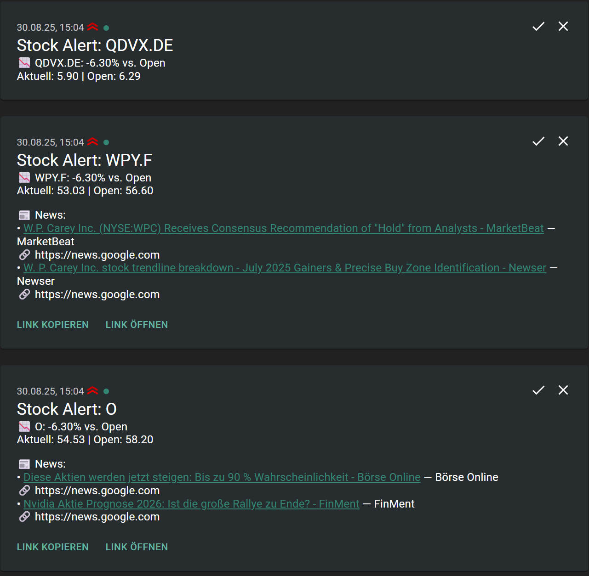
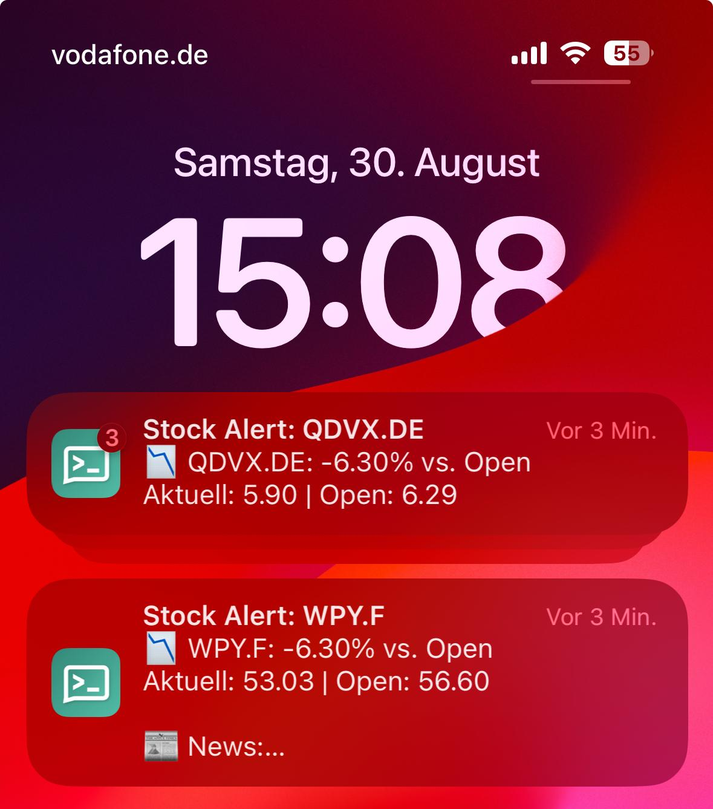

# 📈 Stock Notifier – Push Alerts for Stock Movements

> **Short Description:**  
> This project monitors selected stocks and ETFs using Yahoo Finance.
> If a price moves more than a defined percentage from the daily opening price, you receive a push notification on your phone via ntfy.sh.
> Optionally, the alert also includes latest news headlines about the company or ETF.

**Example output on desktop (web):**



**Example output on mobile device (app):**



---

## 🚀 Features

- **Automated stock monitoring**  
  Monitors defined tickers (e.g. AAPL, SAP.DE, IQQH.DE for ETFs).
- **Push alerts via ntfy**  
  Delivered directly as push notifications to your smartphone (Android, iOS, or desktop browser).
- **Configurable threshold**  
  Notifications only if the price change is e.g. > ±3%.
- **Market hours filter**  
  Alerts only during configurable trading hours (default: Mon–Fri, 08:00–22:00 Berlin time).
- **News integration**
  Fetches latest Google News headlines for the company (or ETF) and attaches them to the alert.
  - Headlines are filtered by keywords (company name & ticker).
  - Links are shortened with the domain displayed but still clickable.
  - Markdown formatting supported (in ntfy web app).
- **Anti-spam state**  
  Prevents duplicate notifications. A new alert is only sent once the stock returns to the threshold corridor.
- **Logging**  
  Configurable log level (`DEBUG`/`INFO`/`WARNING`…), optional rotating log file.
- **Test mode**  
  Easily test without real price data or actual pushes (`dry_run`, `force_delta_pct`).
- **Environment variable overrides**
  Sensitive data like ntfy topic can be set via .env instead of config file.

---

## 🗂 Project Structure

```bash
└── 📁stock_notifier
        └── 📁src
            └── 📁app
                ├── __init__.py
                ├── company.py  
                ├── config.py
                ├── core.py
                ├── logging_setup.py
                ├── market.py
                ├── news.py
                ├── ntfy.py
                ├── state.py
    ├── .env
    ├── .gitignore
    ├── config.json
    ├── main.py
    ├── README.md
    └── requirements.txt
```

- `company.py`: Resolves company names via yfinance, builds keywords
- `config.py`: Loads 'config.json' + '.env', merges with defaults
- `core.py`: Main logic: thresholds, news fetching, ntfy alerts
- `logging_setup.py`: Configurable logging with rotation
- `market.py`: Fetches prices (intraday or daily) via yfinance
- `news.py`: Google News RSS integration + filters
- `ntfy.py`: Push notifications to ntfy.sh
- `state.py`: Keeps track of last alert state (anti-spam)

## ⚙️ Requirements

- Python **3.10+**
- Internet connection (for yfinance + ntfy)
- ntfy app on your smartphone or desktop  
  - Android: [Google Play](https://play.google.com/store/apps/details?id=io.heckel.ntfy)  
  - iOS: [App Store](https://apps.apple.com/us/app/ntfy/id1625396347)  
  - Desktop: [Web Client](https://ntfy.sh/app)

---

## 🔧 Installation

1. **Clone or download the repository**

   ```bash
   git clone https://github.com/your-user/stock-notifier.git
   cd stock-notifier
   ```

2. **Create a virtual environment**

   ```bash
   python -m venv .venv
   # Linux:
   source .venv/bin/activate 
   # Windows: 
   .venv\Scripts\activate
   ```

3. **Install dependencies**

   ```bash
   pip install -r requirements.txt
   ```

## 📝 Configuration

1. **Sensitive data**
   - Create a `.env` file in the project root:

      ```env
      # ntfy settings (Secret!):
      NTFY_TOPIC=your-topic-from-ntfy
      NTFY_SERVER=https://ntfy.sh

      # Optional: Override log level
      LOG_LEVEL=DEBUG
      ```

2. **Project settings**
   - Example for `config.json:`:

      ```json
      {
        "tickers": ["AAPL", "SAP.DE", "IQQH.DE"],
        "threshold_pct": 3.0,
        "log": {
          "level": "INFO",
          "to_file": true,
          "file_path": "alerts.log",
          "file_max_bytes": 1000000,
          "file_backup_count": 3
        },
        "market_hours": {
          "enabled": true,
          "tz": "Europe/Berlin",
          "start_hour": 8,
          "end_hour": 22,
          "days_mon_to_fri_only": true
        },
        "news": {
          "enabled": true,
          "limit": 2,
          "lookback_hours": 12,
          "lang": "de",
          "country": "DE",
          "fallback_lang": "en",
          "fallback_country": "US"
        },
        "test": {
          "enabled": false,
          "bypass_market_hours": true,
          "force_delta_pct": null,
          "dry_run": false
        },
        "state_file": "alert_state.json"
      }
      ```

## ▶️ Usage

- Start the notifier:
  
  ```bash
   python main.py
  ```

- Example log output:

   ```bash
  2025-08-30 08:41:01 INFO Job start (2025-08-30 08:41:01), Ticker=AAPL,SAP.DE, Schwelle=±3.0%
  2025-08-30 08:41:01 INFO Handelszeit? True (effective=True)
  2025-08-30 08:41:02 INFO AAPL | Last=232.27 Open=232.56 Δ=-0.12%
  2025-08-30 08:41:02 INFO SAP.DE | Last=120.12 Open=116.00 Δ=+3.55%
  2025-08-30 08:41:02 INFO State change (SAP.DE): none → up. Sending alert.
  2025-08-30 08:41:02 INFO Sending ntfy: title='Stock Alert: SAP.DE', topic(masked)='7…z0'
   ```

- On your smartphone you will see e.g.:

  ```bash
  📈 SAP.DE: +3.55% vs. Open
  Aktuell: 120.12 | Open: 116.00

  📰 News:
  • SAP expands AI capabilities — Reuters
    🔗 [reuters.com](https://www.reuters.com/…)
  ```

## 🧪 Test Mode

Safe testing without real notifications:

```json
"test": {
  "enabled": true,
  "bypass_market_hours": true,
  "force_delta_pct": 4.2,
  "dry_run": true
}
```

- `force_delta_pct`: Simulates a price change (e.g. +4.2%).
- `dry_run: true`: No push to ntfy, only log output.

## 🗒️ State File

The notifier stores the last alert state (per ticker) in a small JSON file `alert_state.json`:

```json
{
  "AAPL": "up",
  "SAP.DE": "none"
}
```

This prevents repeated alerts on every run.
Once the price goes back inside the threshold corridor, the state resets to "none".